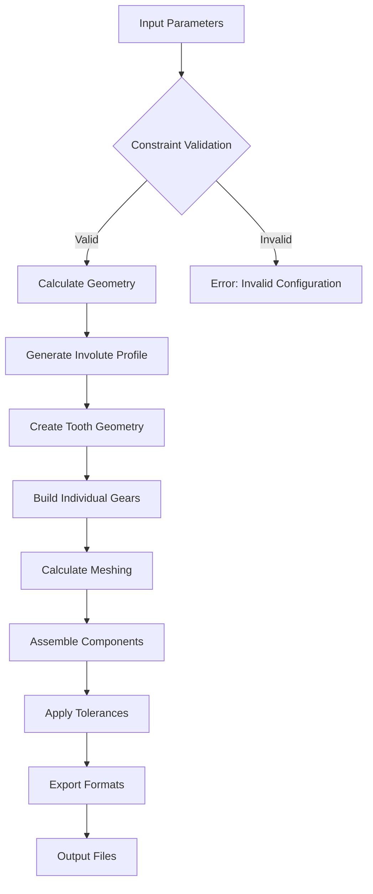

# CadQuery Planetary Gear System Generator

Parametric 3D gear generation framework with mathematical validation and CAD export capabilities.

[](https://www.python.org/downloads/)
[](https://cadquery.readthedocs.io/)
[](https://www.opencascade.com/)
[](LICENSE)

## Overview

A comprehensive framework for generating planetary gear assemblies with involute tooth profiles, constraint validation, and multi-format export capabilities. Built on CadQuery and OpenCascade OCCT for professional CAD-grade precision.

<p align="center">
  
</p>
<p align="center">
  
  
</p>


## System Architecture

```
┌─────────────────┐    ┌─────────────────┐    ┌─────────────────┐
│   Input Layer   │    │ Processing Core │    │  Output Layer   │
│                 │    │                 │    │                 │
│ • Parameters    │───▶│ • Constraint    │───▶│ • STL/STEP      │
│ • Constraints   │    │   Validation    │    │ • PNG/SVG       │
│ • Tolerances    │    │ • Geometry Gen  │    │ • Assembly      │
└─────────────────┘    │ • Meshing Calc  │    └─────────────────┘
                       │ • Assembly      │
                       └─────────────────┘
```

### Generated Assemblies
- **Complete Planetary**: 4-Planet system (Sun: 20T, Planets: 16T, Ring: 52T)
- **Printable Version**: Scaled with manufacturing tolerances
- **Herringbone**: Double-helical design for axial force cancellation

---

## 🚀 **Key Features & Capabilities**

<table>
<tr>
<td width="33%" align="center">

### ⚙️ **Gear Varieties**
🔹 **Spur Gears** - Standard straight-cut<br>
🔹 **Helical Gears** - Angled for smooth operation<br>
🔹 **Herringbone Gears** - Double-helical design<br>
🔹 **Ring Gears** - Internal gears for planetary systems<br>
🔹 **Complete Assemblies** - Ready-to-print systems

</td>
<td width="33%" align="center">

### 🔬 **Mathematical Precision**
📐 **Involute Tooth Profiles** - True gear geometry<br>
📏 **Parametric Design** - Fully configurable<br>
🎯 **Auto Meshing** - Perfect tooth alignment<br>
📊 **Constraint Validation** - Prevents impossible configs<br>
🔢 **Scaling Systems** - Maintain ratios perfectly

</td>
<td width="33%" align="center">

### 🖨️ **3D Print Ready**
🔧 **Tolerance Control** - Adjustable clearances<br>
🎛️ **Support-Free Design** - Optimized geometry<br>
📦 **Multiple Formats** - STL, STEP, PNG export<br>
🎨 **Visualization** - Interactive 3D preview<br>
⚡ **Rapid Prototyping** - From code to print

</td>
</tr>
</table>

## Dependencies & Requirements

### Core Framework
- **CadQuery 2.6+**: Parametric CAD modeling engine
- **OpenCascade OCCT 7.0+**: Professional geometry kernel
- **Python 3.8+**: Runtime environment

### Mathematical Libraries
- **NumPy**: Array operations and mathematical functions
- **SciPy**: Advanced mathematical computations

### Visualization (Optional)
- **jupyter-cadquery 4.0+**: 3D visualization and PNG export
- **Matplotlib**: 2D plotting and technical drawings

## Project Structure

```
Peristaltic_pump/
├── src/                           # Core library modules
│   ├── __init__.py               # Package initialization
│   ├── utilization.py           # Geometry utilities
│   ├── spur_gear.py             # Base gear classes
│   └── Ring_gear.py             # Ring gears and assemblies
├── examples/                      # Implementation examples
│   └── Planetary_gear_system.ipynb  # Complete tutorial
├── output/                        # Generated files
│   ├── *.stl                    # 3D printable models
│   ├── *.step                   # CAD interchange
│   ├── *.png                    # Documentation images
│   └── *.svg                    # Technical drawings
├── requirements.txt               # Dependencies
└── README.md                      # Documentation
```

## Gear Generation Pipeline



### Algorithm Steps

1. **Parameter Validation**
   - Verify planetary gear constraints
   - Check manufacturing feasibility
   - Validate geometric relationships

2. **Geometry Generation**
   - Calculate involute tooth profiles
   - Determine pitch circles and base circles
   - Generate 3D gear bodies

3. **Assembly Process**
   - Position planets at correct orbital radius
   - Calculate rotation for proper meshing
   - Apply alignment corrections

4. **Export Pipeline**
   - Generate STL meshes for 3D printing
   - Create STEP files for CAD integration
   - Produce PNG/SVG for documentation

---

## Quick Start Guide

### Installation

```bash
# Core dependencies
pip install cadquery numpy jupyter

# Visualization components (optional)
pip install jupyter-cadquery matplotlib

# Install all dependencies
pip install -r requirements.txt
```

### Basic Usage

```python
# Import the gear library
import sys
sys.path.append('./src')
from spur_gear import SpurGear
from Ring_gear import RingGear

# Create individual gears
sun_gear = SpurGear(module=1.0, teeth_number=20, width=10.0, bore_d=6.0)
ring_gear = RingGear(module=1.0, teeth_number=52, width=10.0, rim_width=3.0)

# Build and export
sun_built = sun_gear.build()
sun_built.exportStl('my_first_gear.stl')

print("Gear exported successfully")
```

### Complete Planetary System

```python
from Ring_gear import PlanetaryGearset

# Create complete planetary system with mathematical validation
planetary = PlanetaryGearset(
    module=1.0,
    sun_teeth_number=20,      # Central sun gear
    planet_teeth_number=16,   # Planet gears (4 planets)
    width=10.0,
    rim_width=3.0,
    n_planets=4,
    bore_d=6.0
)

# Build and export complete assembly
planetary_built = planetary.build()
planetary_built.exportStl('complete_planetary_system.stl')

print("Complete planetary gear system ready")
```

## Mathematical Constraints

### Planetary Gear Design Rules

**Critical Design Requirements:**
1. **Ring teeth = Sun teeth + 2 × Planet teeth**
2. **(Sun teeth + Ring teeth) ÷ Number of planets = Integer**
3. **(Sun teeth + Planet teeth) ÷ Number of planets = Integer**

### Validated Configurations

| Configuration | Sun | Planet | Ring | Planets | Status |
|:---:|:---:|:---:|:---:|:---:|:---:|
| **Recommended** | 20 | 16 | 52 | 4 | ✓ Valid |
| **Alternative** | 18 | 18 | 54 | 3 | ✓ Valid |
| **High-Speed** | 24 | 12 | 48 | 6 | ✓ Valid |

## Configuration Parameters

### Gear Specifications

| Parameter | Description | Range | Default |
|:---:|:---:|:---:|:---:|
| `module` | Gear size factor (mm/tooth) | 0.5 - 5.0 | 1.0 |
| `teeth_number` | Number of teeth | 8 - 120 | 20 |
| `width` | Gear thickness (mm) | 2.0 - 50.0 | 10.0 |
| `bore_d` | Central hole diameter (mm) | 2.0 - 20.0 | 6.0 |
| `helix_angle` | Helical angle (degrees) | 0° - 45° | 30° |

### Manufacturing Parameters

| Parameter | Description | Recommended |
|:---:|:---:|:---:|
| `backlash` | Tooth clearance (mm) | 0.1 - 0.3 |
| `clearance` | Manufacturing tolerance (mm) | 0.1 - 0.5 |
| `ring_alignment_factor` | Fine-tuning (0.0-1.0) | 0.5 |

## Implementation Examples

### Educational Model
```python
# Simple gear system for learning
educational_model = PlanetaryGearset(
    module=2.0,           # Large and visible
    sun_teeth_number=12,  # Simple ratios
    planet_teeth_number=18,
    width=15.0,           # Thick for durability
    n_planets=3,          # Easy to understand
    clearance=0.3         # Loose fit for assembly
)
```

### High-Precision Industrial
```python
# For robotics and precision applications
precision_system = PlanetaryGearset(
    module=1.0,           # Standard industrial size
    sun_teeth_number=20,  # Optimized ratio
    planet_teeth_number=16,
    width=8.0,            # Compact design
    n_planets=4,          # Balanced load distribution
    clearance=0.1,        # Tight tolerances
    backlash=0.05         # Minimal play
)
```

### Custom-Sized for 3D Printing
```python
def create_custom_planetary(ring_diameter=60.0, clearance=2.0):
    """Automatically scales to desired ring diameter"""
    return create_planetary_with_clearance(
        ring_outer_diameter=ring_diameter,  # Target size
        clearance_offset=clearance          # 3D printer tolerances
    )

# Create 60mm diameter system with 2mm clearances
my_gearbox = create_custom_planetary(ring_diameter=60.0, clearance=2.0)
```

## Visualization & Export

### Interactive 3D Visualization
```python
# Generate 3D preview
from jupyter_cadquery import show
show(planetary_built)
```

### Export Formats

| Format | Usage | Quality |
|:---:|:---:|:---:|
| **STL** | 3D Printing | High mesh |
| **STEP** | CAD Integration | Exact geometry |
| **PNG** | Documentation | Visual |
| **SVG** | Technical drawings | Vector graphics |

## Generated Files

### Recommended Files

| File | Description | Size | Quality |
|:---:|:---:|:---:|:---:|
| **`planetary_gearset_corrected.stl`** | **Perfect mathematical design** | ~2-5 MB | Excellent |
| **`planetary_printable_D60_C2.0.stl`** | **3D printer optimized** | ~3-6 MB | Excellent |
| **`planetary_gearset_complete.png`** | **Documentation image** | ~500 KB | High |

### Complete Output Collection

**Individual Components:**
- `sun_gear.stl` - Central sun gear
- `planet_gear.stl` - Individual planet gear  
- `ring_gear.stl` - Ring gear housing

**Complete Assemblies:**
- `planetary_gearset_corrected.stl` - **RECOMMENDED**: Mathematically verified
- `planetary_printable_D60_C2.0.stl` - 60mm diameter with 2mm clearance
- `hb_planetary_gearset.stl` - Herringbone version for smooth operation

**Fine-Tuning Variants:**
- `planetary_test_factor_*.stl` - Various alignment configurations

## Applications

| Domain | Use Cases |
|--------|----------|
| **Robotics** | Servo motor gearboxes, robotic joint drives, high-torque applications |
| **Industrial** | Conveyor systems, CNC transmissions, automated assembly tools |
| **Education** | Mechanical engineering demos, 3D printing projects, gear theory |
| **Prototyping** | Custom gear ratios, functional testing, design iteration |

## Best Practices

### Mathematical Accuracy
- All gear profiles use true involute geometry for proper meshing
- Library enforces planetary gear constraints automatically  
- Prevents impossible configurations before generation

### 3D Printing Guidelines
- **Layer Height**: Recommended 0.2mm or finer for smooth operation
- **Tolerances**: Built-in clearances designed for typical FDM printers
- **Support Material**: Ring gears may require supports depending on orientation
- **Orientation**: Print planets flat, sun gear upright for best quality

### Performance Optimization
- **Generation Time**: Complex assemblies take 30-60 seconds to generate
- **File Sizes**: STL files range from 1-10MB depending on complexity
- **Memory Usage**: Large assemblies require sufficient RAM for mesh generation

## Contributing

### Contribution Areas
- Additional gear types (bevel, worm, rack & pinion)
- Advanced tooth profile modifications
- Performance optimizations
- Documentation improvements
- Test coverage expansion

### Ideas Welcome
- Gear stress analysis integration
- Dynamic simulation capabilities
- Advanced manufacturing tolerances
- Custom tooth profiles

---

## 📜 **License & Credits**

<div align="center">

### 🛡️ **Open Source Excellence**

**Built with using world-class open-source tools:**

| Library | License | Purpose |
|:---:|:---:|:---:|
| **CadQuery** | Apache 2.0 | CAD modeling engine |
| **OpenCascade** | LGPL | Professional geometry kernel |
| **NumPy** | BSD | Mathematical computations |
| **Python** | PSF | Programming language |

*This project stands on the shoulders of giants in the open-source community.*

</div>

---

## 🔗 **Resources & Documentation**

### 📚 **Essential References**
- 📖 [**CadQuery Documentation**](https://cadquery.readthedocs.io/) - Complete CAD modeling guide
- 🏭 [**OpenCascade Technology**](https://www.opencascade.com/) - Industrial CAD kernel
- ⚙️ [**Involute Gear Theory**](https://en.wikipedia.org/wiki/Involute_gear) - Mathematical foundations
- 🌍 [**Planetary Gear Mathematics**](https://en.wikipedia.org/wiki/Planetary_gear) - Design principles

### 🎓 **Learning Resources**
- 🔬 **Gear Design Fundamentals** - Understanding tooth profiles and meshing
- 🏗️ **3D Printing for Mechanical Parts** - Optimizing designs for additive manufacturing
- 🤖 **Robotics Gear Systems** - Applications in robotic actuators
- 📐 **CAD Programming with Python** - Advanced CadQuery techniques

## Getting Started

```bash
git clone https://github.com/username/Peristaltic_pump.git
cd Peristaltic_pump
pip install -r requirements.txt
jupyter notebook examples/Planetary_gear_system.ipynb
```

Built with CadQuery and OpenCascade for professional-grade precision.
