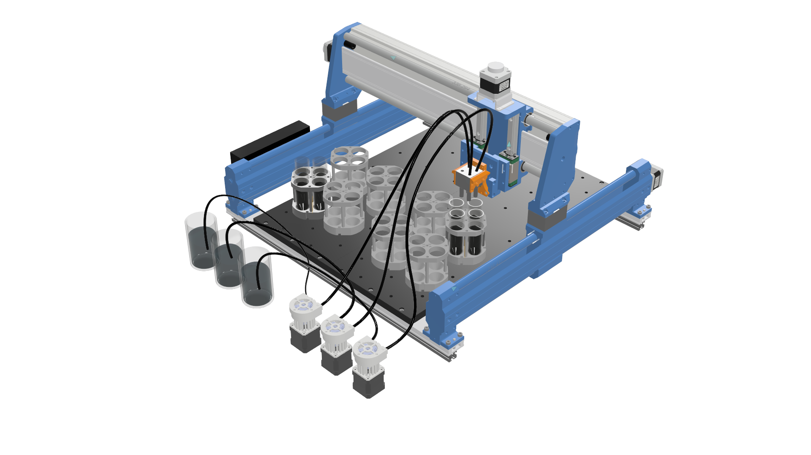
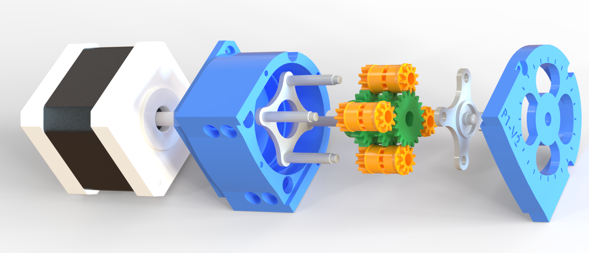
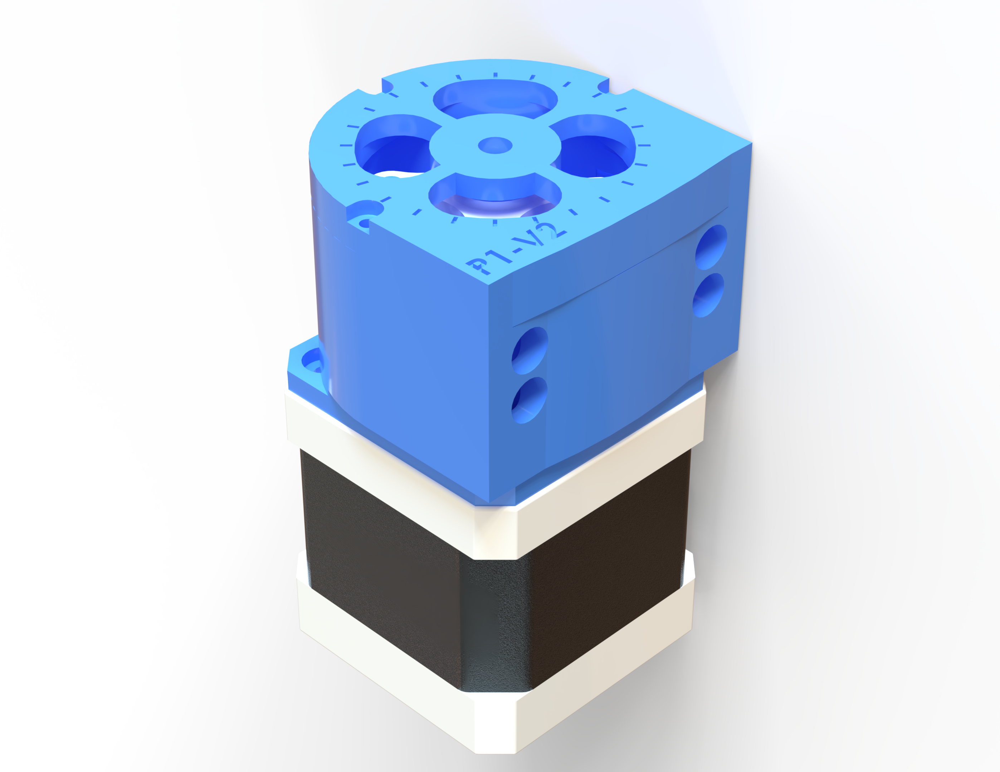
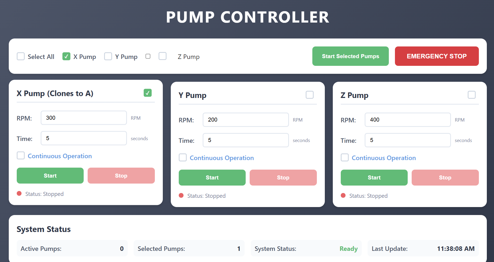

# Micro Liquid Handling System

This project presents a novel peristaltic pump system for pharmaceutical liquid handling, capable of dispensing fluids with viscosities ranging from 1 cP to 60,000 cP. The system integrates advanced solid and fluid mechanics in its mechanical design, optimized for uniform flow rate and precise dispensing. The pump and its control interface are shown below:



## Project Overview

- **Novel Mechanical Design:** The pump geometry is optimized for uniform flow and precision, supporting a wide viscosity range.
- **Patent & Publication:** CAD files and a link to the scientific paper will be uploaded after patent and publication (CAD folder is currently empty).
- **Integrated Hardware & Software:** Combines custom hardware, Arduino firmware, and a modern web-based UI for control.
- **Drivers:** 4x DRV8825 stepper motor drivers
- **Motors:** 4x NEMA 17 stepper motors
- **Pump Heads:** 4-roller peristaltic design
- **Power Supply:** 12V, 1.5A
- **Pin Configuration:**
  - Pump X: Step=2, Dir=5, Enable=8
  - Pump Y: Step=3, Dir=6, Enable=8
  - Pump Z: Step=4, Dir=7, Enable=8
  - Pump A: Step=12, Dir=13, Enable=8

## Mechanical & CAD Files

- **CAD Folder:** `Hardware/CAD/` (currently empty; files will be uploaded post-publication)
- **Images:**
  - 

## Software Architecture

- **Frontend:** Responsive web dashboard (HTML/CSS/JS)
- **Backend:** Python Flask server (`main.py`, `serial_handler.py`)
- **Firmware:** Arduino sketch (`PumpController.ino`)
- **Serial Communication:** Robust USB protocol between Python and Arduino

### System Diagram
```
┌───────────────┐    HTTP/WebSocket    ┌───────────────┐    Serial USB    ┌───────────────┐
│ Web Browser   │ ◄──────────────────►│ Python Flask  │◄───────────────►│ Arduino Uno   │
│ (Frontend)    │                     │ (Backend)     │                  │ (Controller)  │
└───────────────┘                     └───────────────┘                  └───────────────┘
```

## Installation & Setup

1. **Clone the Repository:**
	```bash
	git clone https://github.com/mahdi-rstgr/Micro_Liquid_Handling.git
	cd Micro_Liquid_Handling
	```
2. **Install Python Dependencies:**
	```bash
	pip install flask flask-cors pyserial
	```
3. **Upload Arduino Firmware:**
	- Open `Software/PumpControlSystem/arduino/PumpController/PumpController.ino` in Arduino IDE
	- Select board and COM port, upload sketch
4. **Hardware Assembly:**
	- Connect drivers, motors, pump heads, and power supply as per pin configuration
	- Connect Arduino to PC via USB
5. **Start Backend:**
	```bash
	cd Software/PumpControlSystem/python_backend
	python main.py
	```
6. **Access UI:**
	- Open browser at `http://localhost:5000`

## Usage

- **Web Dashboard:**
  - Set RPM, duration, and continuous mode for each pump
  - Start/stop pumps individually or in batch
  - Emergency stop and real-time status
- **Serial Commands:**
  - `START,X,50,10,0` (Start pump X at 50 RPM for 10s)
  - `STOP,X` (Stop pump X)
  - `EMERGENCY` (Stop all pumps)
  - `STATUS` (Get status)

## Project Structure

```
Micro_Liquid_Handling/
├── Hardware/
│   ├── CAD/                # CAD files (to be uploaded)
│   └── images/             # Pump images and schematics
├── Software/
│   └── PumpControlSystem/
│       ├── arduino/
│       │   └── PumpController/
│       │       └── PumpController.ino
│       ├── python_backend/
│       │   ├── main.py
│       │   ├── serial_handler.py
│       │   └── frontend/
│       │       ├── index.html
│       │       ├── script.js
│       │       └── style.css
│       └── Dashboard/
│           └── UI.png
└── README.md
```

## User Interface

The Micro Liquid Handling System features a modern, web-based dashboard for intuitive control of the peristaltic pumps. The user interface allows:

- Setting and adjusting the RPM (rotations per minute) for each pump
- Specifying dispensing time for precise liquid handling
- Enabling/disabling continuous operation mode
- Starting and stopping pumps individually or in batch
- Monitoring real-time status and feedback
- Emergency stop for immediate shutdown of all pumps

Below is a screenshot of the user interface:



## Technical Specifications

- **Viscosity Range:** 1–60,000 cP
- **Max RPM:** 3000 (firmware), 1000 (UI recommended)
- **Stepper Resolution:** 3200 steps/rev
- **Serial Baud Rate:** 9600 bps
- **API:** RESTful JSON, 2s polling
- **Supported OS:** Windows, macOS, Linux

## Future Development

- Volume dispensing calibration
- Machine learning for viscosity compensation
- Flow sensors and PID control
- Data logging and analytics
- Mobile and cloud connectivity

## Important Notes

- **RPM values are nominal; actual RPM depends on load, torque, and gear ratios.**
- **All pumps stop when the shortest timer expires (shared clock).**
- **CAD files and publication link will be added after patent/publication.**

---

*This project is a robust foundation for advanced liquid handling in pharmaceutical and research applications. For questions or contributions, please contact the repository owner.*
